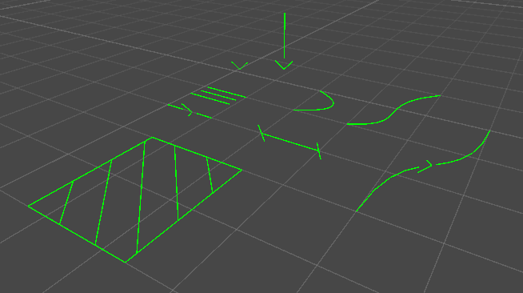

# WeatherUtils

A Weatherlight custom made package with useful development tools for anyone!

This package includes some major or minor tools that we often use to develop our games. You can see them and how they work in the following sections!

# Downloading and using
To use this package inside Unity simply open `Window > Package Manager`, on the window that appears click the "+" icon and select "Add Package from git URL...", then paste the link you get from this repository (https://github.com/Cogno-Marco/WeatherUtils.git) and Unity will do the rest!
When Unity has downloaded and included this package you can directly use it (see next sections for tools found in the package and how to use them)

# Bezier Curves
A collection of efficient bezier curves implementations

### Usage
Simply call `BezierCurves.` and then the function you want to use. Documentation can be found in the `BezierCurves.cs` file and a usage example in `CustomGizmosTester.cs`

Available functions are divided in param-like Bezier curves (which return a single point on the curve) and list-like Bezier curves (which return a list of points on the curve)

Usage example
```CSharp
void Update(){
    transform.position = BezierCurves.Quadratic(
        new Vector3(0, 0, 0,), 
        new Vector3(0.5f, 2, 0.5f),
        new Vector3(1, 0, 1),
        Mathf.Sin(Time.time)
    );
}
```

# Custom Gizmos
A collection of useful development Editor-only gizmos.
You can see them here:


### Usage
These gizmos only work in `OnDrawGizmos` and `onDrawGizmosSelected` Unity function.
Simply define a color and use them like this
```CSharp
private void OnDrawGizmos(){
    Gizmos.Color = Color.green;
    CustomGizmos.DrawArrow(...);
}
```
You can see documentation on each function in the `CustomGizmos.cs` file and a usage example in `CustomGizmosTester.cs`


# Contributing
Contributions on this repository are accepted!
To properly contribute:
1. Create a new empty Unity project
2. Navigate to the Unity project folder
3. Enter the `Packages` folder
4. Create a new empty folder called `WeatherUtils`
5. Fork this repository into your account
6. Clone your forked repository into the `WeatherUtils` folder
7. Edit, Create and Test what you want
8. Create a pull-request into the original repository


# License
TBD